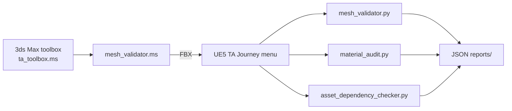
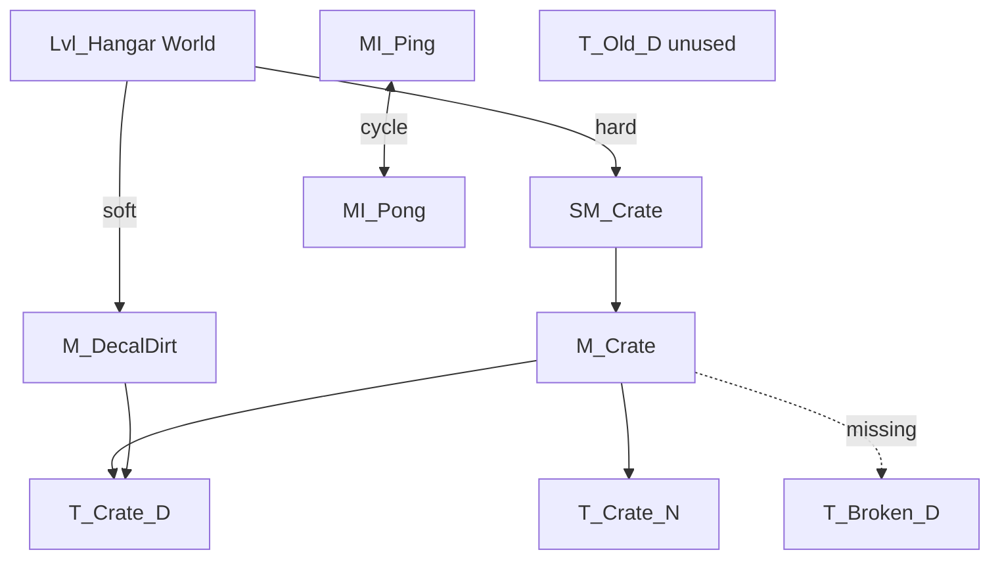
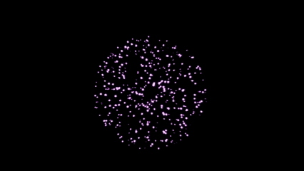
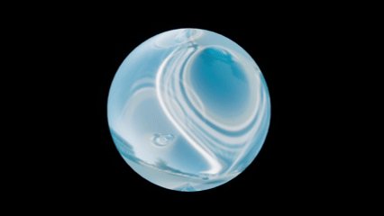

# ta-journey

Personal learning path toward a **Junior Technical Artist** role in games.

This repository is a public journal of pipeline tools, MAXScript, Unreal Python, and shader experiments built during TA training. Shader graphs live in Unreal Engine 5; this repo keeps the scripts, naming rules, and preview GIFs.

> **Stack:** 3ds Max · Unreal Engine 5 · MAXScript · Python · Material Editor / HLSL

**ArtStation:** [lazarus-inq](https://www.artstation.com/lazarus-inq) · **GitHub:** [LAZARUS-inq](https://github.com/LAZARUS-inq)

---

## What is in here

| Folder | Contents |
|---|---|
| [`maxscript/`](maxscript/) | Pre-export tools + `ta_toolbox.ms` UI for 3ds Max |
| [`python/`](python/) | Naming pipeline, FBX scanner, pymxs, UE5 Editor scripts + dependency graph |
| [`shaders/`](shaders/) | Preview GIFs of UE5 materials, Niagara, and LOD visualization |
| [`examples/`](examples/) | Sample JSON reports (readable without Unreal) |
| [`tests/`](tests/) | Vanilla Python checks (no Max / UE5 required) |
| `reports/` | JSON/TXT reports written at runtime (gitignored) |

```
ta-journey/
├── maxscript/        # including ta_toolbox.ms
├── python/           # including asset_dependency_checker.py
├── shaders/
├── examples/
├── tests/
└── reports/          # created automatically
```

---

## Naming convention

All tools in this repo enforce the same studio-style prefixes.

| Prefix | Asset | Example |
|---|---|---|
| `SM_` | Static mesh | `SM_Crate_001` |
| `SK_` | Skeletal mesh | `SK_Character` |
| `ENV_` | Environment mesh | `ENV_Wall_01` |
| `T_` | Texture | `T_Crate_D`, `T_Crate_N`, `T_Crate_ORM` |
| `M_` | Material | `M_Hologram` |
| `MI_` | Material instance | `MI_Hologram_Blue` |
| `MF_` | Material function | `MF_Ripple` |
| `MPC_` | Material Parameter Collection | `MPC_Weather` |

Texture suffixes checked by `texture_checker.py`: `_D` `_N` `_S` `_M` `_E` `_H` `_ORM` `_MRA` `_RMA` `_ARM` `_Mask` `_ORMH`.

---

## Pipeline: 3ds Max → UE5

Two-stage mesh validation. Max catches export problems; Unreal catches import/setup problems.



| Stage | Tool | Checks | Auto-fix (opt-in) |
|---|---|---|---|
| Pre-export | `maxscript/mesh_validator.ms` | `SM_` name, pivot at origin, scale `(1,1,1)`, UV0, leftover modifiers, triangle cap | Naming, pivot → `(0,0,0)`, `ResetXForm` |
| Post-import | `python/mesh_validator.py` | `SM_` name, LOD count, **lightmap UV1+**, collision (primitives or complex), triangle cap, Nanite on low-poly | Naming only |

Dry-run is the default. Read the report, then set `MODE = "fix"` (Max) or `MODE = "fix"` (UE5) at the top of the file.

---

## Flagship: Asset Dependency Checker

Naming tools catch `T_` vs `M_`. They do **not** catch a texture nobody uses, a material pointing at a deleted asset, or two instances parenting each other. That is what a TA is hired to find before a build.

`python/asset_dependency_checker.py` walks `/Game` through **AssetRegistry** (no need to load every asset), builds a package graph, and reports:

| Finding | Meaning |
|---|---|
| **Unused** | Not reachable from a map / level sequence. Cyclic islands (A↔B with no level ref) count as unused. |
| **Missing** | A `/Game/...` package is referenced but not in the registry (redirector, bad merge, deleted asset). |
| **Hard-ref cycles** | A → B → A load loop (typical: instance parents). |
| **Hubs** | Most-referenced packages — shared textures/materials. |
| **Heaviest** | Packages with the most outgoing dependencies. |
| **Query** | Set `QUERY_PACKAGE` to answer “who uses `T_Crate_D`?” |

The graph math lives in `python/dependency_graph.py` with **no Unreal import**, so it is unit-tested in CI. A full report can be read without the editor: [`examples/dependency_report_sample.json`](examples/dependency_report_sample.json).



This tool **never deletes**. It only writes JSON.

---

## Editor UIs

Loose scripts look like homework. These two wrap the same tools as a studio shelf.

**3ds Max** — *Scripting → Run Script → `maxscript/ta_toolbox.ms`*

- Rename `SM_*`, center pivot, validate dry / fix (fix asks before ResetXForm), batch FBX export

**Unreal Engine 5** — *Tools → Execute Python Script → `python/register_ta_menu.py`* once per session

Menu **TA Journey**: Texture Checker · Material Audit · Mesh Validator · Asset Dependency Checker

To have the menu on editor startup, copy `python/init_unreal.py` to `<Project>/Content/Python/init_unreal.py` (and keep this `python/` folder on Unreal’s Python path).

---

## Shader experiments

Procedural materials and VFX built in the UE5 Material Editor. Full stills and breakdowns: [ArtStation](https://www.artstation.com/lazarus-inq). `.uasset` graphs stay in the engine project; GIFs below are viewport captures.

| Hologram | Niagara VFX | Water |
|---|---|---|
|  |  |  |

| Material | Technique | Driven by | Preview |
|---|---|---|---|
| **Hologram** | Fresnel edge + UV panner + sine scanlines | Time / panner speed | `M_Hologram_preview.gif` |
| **Water** | Dual panners, sine waves, Fresnel at grazing angles | Two UV panners + Time | `M_Water.gif`, `M_Water_S.gif` |
| **Fire Dissolve** | Noise mask + emissive glow, animated cutout | Blueprint Timeline | `M_Dissolve.gif`, `M_Dissolve_V.gif` |
| **Magic VFX** | Niagara system + custom particle material | Niagara modules | `NIAGARA.gif`, `NIAGARA_V.gif`, `NIAGARA_X.gif` |
| **Snow accumulation** | World-aligned blend onto surfaces + snowfall | MPC + Niagara | [ArtStation](https://www.artstation.com/artwork/kNgqB6) |
| **Wet surface** | Fresnel, ripples, puddles, rain | Niagara rain + material | [ArtStation](https://www.artstation.com/artwork/L4LAkK) |
| **Decals** | Deferred dirt / damage / wetness, drying cycle | Blueprint Timeline | [ArtStation](https://www.artstation.com/artwork/Ezra32) |
| **Destruction** | Dynamic cracks + emissive glow | Blueprint Timeline + MPC | [ArtStation](https://www.artstation.com/artwork/qJ4NL2) |

**LOD & ISM** (scene optimization, not a material): 4 LOD levels, ~2× triangle reduction per level. Instanced Static Mesh pass: **858 → 373 draw calls (−57%)**, **50.8K → 7952 prims (−85%)**. Viewport clips: `LOD_1.gif`, `LOD_4.gif`. Write-up: [ArtStation](https://www.artstation.com/artwork/lGJkwO).

Procedural materials (`M_Hologram`, `M_Dissolve`, `M_Water`, `M_Rain`, `M_Particle`) are excluded from the “empty material / no textures” check in `material_audit.py`.

---

## Tools

Mutating tools default to **report-only**. Flip `DRY_RUN` / `MODE` / `FIX_NAMING` only after you have read the report. Output goes to `reports/` next to this repo.

Vanilla Python checks (no Max / UE5):

```bash
python -m unittest discover -s tests -v
```

### MAXScript — *Scripting → Run Script*

| Script | What it does |
|---|---|
| `rename_objects.ms` | Selected objects → `SM_<Name>_001` (strips existing `SM_` / `SK_` / `ENV_`) |
| `reset_pivot.ms` | `CenterPivot` on selection (bbox center — modeling helper, not the export-origin check) |
| `batch_export.ms` | One FBX per selected object; folder picker; restores selection |
| `mesh_validator.ms` | Pre-export checks above. `MODE = "dry"` (default) or `"fix"`. `CHECK_SELECTED = true` limits to the selection |
| `ta_toolbox.ms` | One dialog that runs the scripts above (fix mode confirms first) |

### Python — vanilla / pymxs / UE5 Editor (*Tools → Execute Python Script*)

| Script | Runs in | What it does |
|---|---|---|
| `rename_pipeline.py` | Python 3 | Validate a name list (empty / dupes / types) → `SM_Name_001` → JSON |
| `asset_manager.py` | Python 3 | Walk a folder of FBX (nested, case-insensitive), split valid/invalid, dry-run or rename |
| `maxscript_pipeline.py` | 3ds Max `pymxs` | Rename the current selection inside Max + JSON report |
| `texture_checker.py` | UE5 | All `Texture2D` under `/Game/`: `T_` prefix + suffix table, optional rename |
| `material_audit.py` | UE5 | Materials + instances: broken textures, empty graphs, `M_` / `MI_` names, duplicates. `FIX_NAMING = False` by default |
| `mesh_validator.py` | UE5 | StaticMesh post-import checks above. `SCAN_PATH = "/Game"`, `MAX_TRIS = 50000`, `NANITE_TRIS = 5000` |
| `dependency_graph.py` | Python 3 | Package graph: unused / missing / cycles / hubs (no Unreal) |
| `asset_dependency_checker.py` | UE5 | AssetRegistry → graph → JSON. Report-only. Optional `QUERY_PACKAGE` |
| `register_ta_menu.py` | UE5 | Adds **TA Journey** to the Level Editor menu |

Narrow UE5 scans with `SCAN_PATH` (for example `/Game/Materials`) on large projects.

---

## Portfolio

| Project | Description | Link |
|---|---|---|
| Hologram Shader | Fresnel + Panner + Sine animation — UE5 | [ArtStation](https://www.artstation.com/artwork/qJqm3N) |
| Water Shader | Dual Panner + Sine waves + Fresnel — UE5 | [ArtStation](https://www.artstation.com/artwork/y4dVL3) |
| Fire Dissolve Shader | Noise + Emissive glow + Blueprint animation — UE5 | [ArtStation](https://www.artstation.com/artwork/2BA2rY) |
| Magic VFX | Niagara particle system with custom material — UE5 | [ArtStation](https://www.artstation.com/artwork/V2wz15) |
| LOD & ISM Optimization | LOD system + Instanced Static Mesh — UE5 | [ArtStation](https://www.artstation.com/artwork/lGJkwO) |
| Snow Accumulation Shader | World Aligned Blend + Niagara VFX — UE5 | [ArtStation](https://www.artstation.com/artwork/kNgqB6) |
| UE5 Python Texture Checker | Texture naming validator + auto-rename pipeline tool | [ArtStation](https://www.artstation.com/artwork/zxbdPw) |
| Wet Surface Shader | Fresnel + Ripples + Puddles + Niagara Rain — UE5 | [ArtStation](https://www.artstation.com/artwork/L4LAkK) |
| UE5 Material Audit Tool | Full material audit — broken textures, naming violations, duplicates + JSON report | [ArtStation](https://www.artstation.com/artwork/lGg1YV) |
| Decal System | Dirt, damage and wetness deferred decals with animated drying cycle — UE5 | [ArtStation](https://www.artstation.com/artwork/Ezra32) |
| Mesh Validator | Two-stage pipeline tool — 3ds Max pre-export + UE5 post-import validation | [ArtStation](https://www.artstation.com/artwork/x3ld8r) |
| Destruction Material | Dynamic crack shader with Emissive glow + Blueprint Timeline animation — UE5 | [ArtStation](https://www.artstation.com/artwork/qJ4NL2) |

---

## Certifications

| Certificate | Institution | Date |
|---|---|---|
| Introduction to C++ Programming and Unreal | University of Colorado / Coursera | Oct 2025 |
| More C++ Programming and Unreal | University of Colorado / Coursera | Nov 2025 |

---

## Learning resources

### Books
- **The Art of Game Design** — Jesse Schell
- **Game Programming Patterns** — Robert Nystrom *(free: [gameprogrammingpatterns.com](https://gameprogrammingpatterns.com))*
- **The Book of Shaders** — Patricio Gonzalez Vivo *(free: [thebookofshaders.com](https://thebookofshaders.com))*
- **Game Development Patterns with Unreal Engine 5** — Butler & Oliver
- **Game Engine Architecture** — Jason Gregory
- **Real-Time Rendering** — Akenine-Möller

### Online
- [Unreal Engine Learning](https://dev.epicgames.com/community/learning) — official courses
- [tech-artists.org](https://tech-artists.org) — TA community
- [learnpython.org](https://learnpython.org) — Python basics

---

## Roadmap

### Month 1 — Scripting & 3D foundation
- [x] `rename_objects.ms` — batch rename selected objects
- [x] `reset_pivot.ms` — reset pivot to bounding box center
- [x] `batch_export.ms` — FBX batch export with validation
- [x] Python basics — functions, loops, validation, JSON, os
- [x] `rename_pipeline.py` — asset validation + rename pipeline
- [x] `asset_manager.py` — AssetManager class, scan/fix/report pipeline
- [x] `maxscript_pipeline.py` — pymxs API, rename + JSON report inside 3ds Max

### Month 2 & 3 — Unreal Engine 5 & shaders
- [x] Material Editor fundamentals
- [x] Hologram shader — Fresnel + Panner + Sine animation
- [x] Water shader — dual Panner + Sine waves + Fresnel
- [x] Fire Dissolve shader — Noise + Emissive glow + Blueprint animation
- [x] Magic VFX — Niagara particle system with custom material
- [x] 3ds Max → FBX → UE5 pipeline

### Month 4 — Optimization & advanced shaders
- [x] LOD setup in UE5 — 4 levels, 2× polygon reduction per level
- [x] Mesh LOD Coloration — viewport visualization of LOD distances
- [x] ISM optimization — 858 → 373 draw calls (−57%), 50.8K → 7952 prims (−85%)
- [x] Snow Accumulation shader — World Aligned Blend + MPC animation
- [x] Niagara snowfall VFX — custom particle system built from scratch
- [x] `texture_checker.py` — UE5 Python naming validator + auto-fix + JSON report
- [x] Wet Surface shader — Fresnel + Ripples + Puddles + Niagara Rain
- [ ] Profiling with Unreal Insights

### Month 5 — Pipeline tools & portfolio
- [x] `material_audit.py` — UE5 Python full material audit (AssetRegistry + MaterialEditingLibrary)
- [x] Decal System — dirt, damage, wetness deferred decals + Blueprint Timeline
- [x] `mesh_validator.ms` + `mesh_validator.py` — two-stage mesh validation (3ds Max + UE5)
- [x] Destruction Material — dynamic crack shader + Blueprint Timeline + MPC
- [x] ArtStation profile with 12+ projects
- [x] `asset_dependency_checker.py` — UE5 Python dependency graph via AssetRegistry
- [x] `ta_toolbox.ms` + UE5 **TA Journey** menu
- [ ] First job applications

---

## Author

**LAZARUS-inq**
- GitHub: [@LAZARUS-inq](https://github.com/LAZARUS-inq)
- ArtStation: [artstation.com/lazarus-inq](https://www.artstation.com/lazarus-inq)
- Background: C++ / C# / 3ds Max / Python / Unreal Engine 5
- Goal: Junior Technical Artist at a game studio
